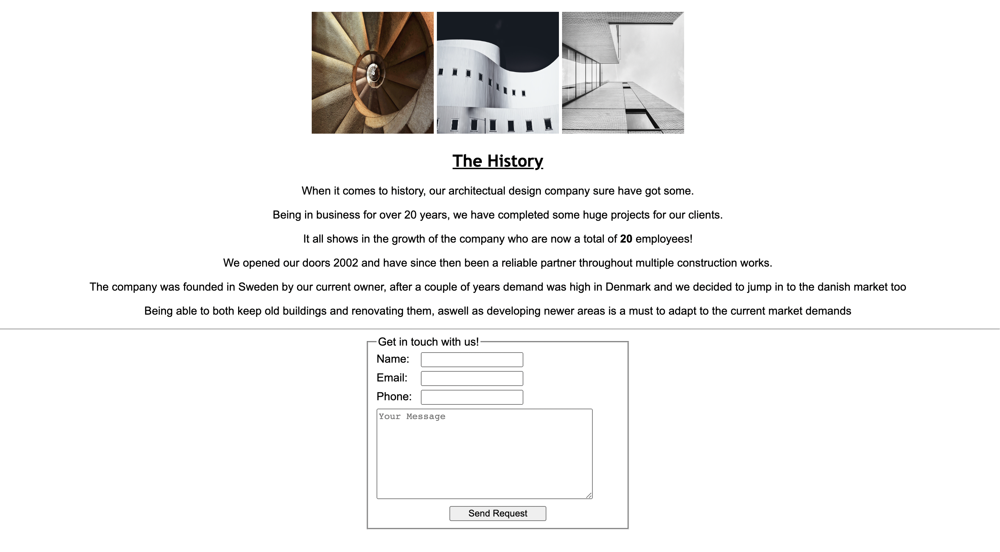

# Architecture designer

Architecture designer is a webpage for a company who wants to inform their customers what they can help them with, what history they have been through and how to get in touch with the company.
Architecture designer is useful for customers that might need help with planning their new construction work or architecture project.

## Features 

In this section, you should go over the different parts of your project, and describe each in a sentence or so. You will need to explain what value each of the features provides for the user, focusing on who this website is for, what it is that they want to achieve and how your project is the best way to help them achieve these things.

### Existing Features

- __Navigation Bar__

  - Featured on the site is a full responsive navigation bar on the top of the page that includes a home section, an about section and a history section all within the first page.

  - This section will allow the user to easily navigate on the site and find the right information straight away, on all different devices.

- __The landing page image__

  - Our landing page is a previous work that the architecture design company have completed to show the user what kind of projects the company can help them with. 
  - This image shows the viewer an eyeopening first project to catch their attention and build trust in what the company can achieve.

- __About us Section__

  - The about us section describes to the viewer why just this architecture design company is the right company to go with, describing three key factors in the company.
  - The user will see the different values of the company, working time efficiency, being family owned and yet affordable.

- __History section__

  - This section will allow the user to read more about the history of the company and get an understanding on how they started and have worked throughout the years.
  - This is to build that trust with the customers and try to get them to feel safe that the architecture design company have been in business for long. 

- __The Footer__ 

  - The footer section is kept simple with relevant social media sites for the company, the links will open in a new tab to allow aesy navigation for the user.
  - The footer is valuable for the user and the company to get them connected on social medias.

- __Gallery__

  - The gallery is kept simple and nice to show of some of the previous work that the business have done and give some inspiration to the viewer.
  - This section is valuable for the user as they will feel safe that the company have done previous work and can show of their previous work. 

- __The contact form__

  - The contact form will allow the customer to easily fill out their information with a message that directly connects them with the architecture designer. All the boxes are marked as required and the form works. 
  - This is really valuable for the viewer as they dont have to leave the site to get in touch with the company.

### Features Left to Implement

- Style the site with different color variations
- Adding more images and more content to the site
- Adding reviews at the bottom of the page
- Adding social media icons to the footer

## Testing 

- Tested navigation bar so that it takes you through the site smoothly
- Tested the contact form so all the fields are required
- Tested the submit button in the contact form so it sends to formdump
- Tested the social media links in the footer
- Tested responsiveness on different devices
- Tested so all images are responsive to media quarry

### Validator Testing 

- HTML
  - No errors were returned when passing through the official [W3C validator](Images/html%20validator.png)
- CSS
  - No errors were found when passing through the official [(Jigsaw) validator](Images/CSS%20validator.png)

### Unfixed Bugs

I did not come across any bugs that werent resolved.

## Deployment

This section should describe the process you went through to deploy the project to a hosting platform (e.g. GitHub) 

- The site was deployed to GitHub pages. The steps to deploy are as follows: 
  - In the GitHub repository, navigate to the Settings tab 
  - From the source section drop-down menu, select the Master Branch
  - Once the master branch has been selected, the page will be automatically refreshed with a detailed ribbon display to indicate the successful deployment. 

The live link can be found here - (Länk här)

## Credits 

- I took help of my mentor on some parts, mainly when I got stuck on some stuff.
- Took huge help of a guy in class called Fredrik Hansen.

In this section you need to reference where you got your content, media and extra help from. It is common practice to use code from other repositories and tutorials, however, it is important to be very specific about these sources to avoid plagiarism. 

You can break the credits section up into Content and Media, depending on what you have included in your project. 

### Content 

- This is an architecture page that I made up to suit the page relevane.
- I have made the contact form myself.

### Media

